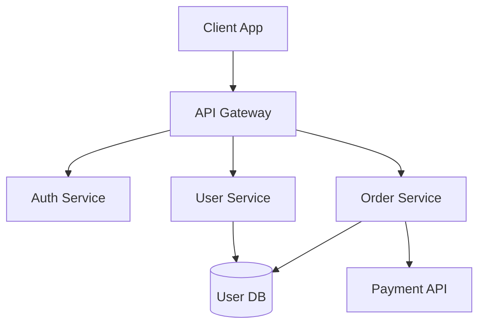
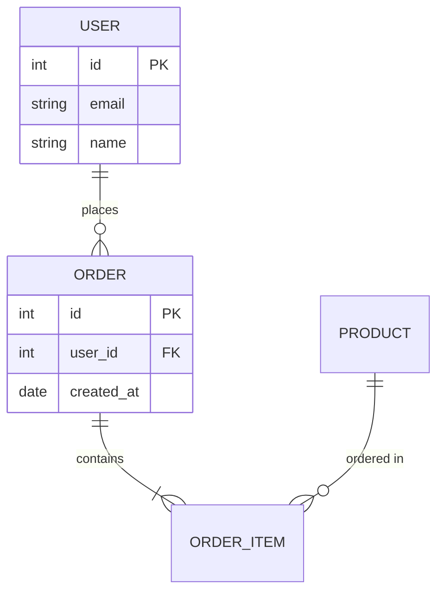

# Code Quality Report

Produce a **Code Quality Assessment Report**. Reports are **platform-specific**: **Frontend** (Mobile & Web) or **Backend**. Use the matching template and criteria below.

## When to Use

- User asks for "code quality report", "quality assessment", or "codebase review report".
- User asks by platform: "frontend report", "backend report", "mobile report", "web report", "FE vs BE", or "mobile & web & backend".
- User mentions migrating or updating code quality rules/skills.
- User requests to "export report as Google Doc" or "export to Google Docs".

## Step 1: Determine Platform

- **Frontend (Mobile & Web)**: Client-side apps — Mobile (Flutter, React Native, etc.) and/or Web (React, Vue, Next, Angular, etc.). Use [report_template_frontend.md](report_template_frontend.md) and Frontend criteria below. In the report header set **Scope** to: _Mobile_ | _Web_ | _Mobile & Web_.
- **Backend (BE)**: APIs, services, databases, auth, jobs, workers. Use [report_template_backend.md](report_template_backend.md) and Backend criteria below.
- **Both (Frontend + Backend)**: Produce **two reports** (one Frontend, one Backend). Optionally add a short "Cross-cutting" section if they share repos or contracts.
- **Three-way (Mobile + Web + Backend)**: For maximum detail, produce **three reports**: one Frontend-Mobile, one Frontend-Web, one Backend. Use the same Frontend template twice with Scope _Mobile_ and _Web_ respectively, and the Backend template once.

## Standards Applied

- **IEEE 730** (Software Quality Assurance)
- **IEEE 1016** (Software Design Description)
- **IEEE 829** (Software Test Documentation)
- **Clean Code** (readable, small functions, naming, DRY)
- **OWASP** (injection, auth, sensitive data, logging)

---

## Scoring Guide (1–10)

Use for every criterion so scores are consistent:

| Score | Meaning           | Example                                                  |
| ----- | ----------------- | -------------------------------------------------------- |
| 1–3   | Needs improvement | No tests, no structure, many security issues             |
| 4–6   | Fair              | Some tests, acceptable structure, partial best practices |
| 7–8   | Good              | Good structure, tests present, minor gaps                |
| 9–10  | Very good         | Consistent, well-tested, documented, production-ready    |

**Total score:** Average of 7 criteria. Round to 1 decimal. Map to: <4 Needs improvement, 4–6.9 Fair, 7–8.4 Good, ≥8.5 Very good.

---

## Common Criteria (All Platforms)

These 7 criteria apply; **what you look at** differs by Frontend vs Backend.

| Criterion             | Backend focus                              | Frontend focus (Mobile & Web)                     |
| --------------------- | ------------------------------------------ | ------------------------------------------------- |
| **Code Organization** | Layers (API/service/repo), modules, naming | Features/pages, components, state layer, naming   |
| **Type Safety**       | Typed APIs, DTOs, DB types                 | Null safety / TypeScript, types, lint, no dynamic |
| **Error Handling**    | Global handler, status codes, logging      | Error boundaries, user messages, logging          |
| **Documentation**     | README, API docs, runbooks                 | README, doc comments, setup                       |
| **Testing**           | Unit, integration, e2e, coverage           | Unit, component/widget, e2e, coverage             |
| **Maintainability**   | DI, no giant files, duplication            | DI/state, component size, reuse                   |
| **Security**          | Auth, secrets, validation, OWASP           | Storage, CSP, tokens, input, OWASP                |

**Optional criterion (include when relevant):**

- **Performance**: Backend — response time, N+1, caching, connection pooling. Frontend — bundle size, Core Web Vitals, lazy load, image optimization.

**Frontend-only consideration:**

- **Accessibility (a11y)**: WCAG, screen readers, contrast, focus — include under Strengths / Areas for improvement or as a short subsection when assessable.

**Cross-cutting (mention in report when assessable):**

- **CI/CD**: Build, test in pipeline, deploy, env management — can be under Testing or Documentation.
- **Observability**: Logging, metrics, tracing, alerting — can be under Error Handling or Documentation.

---

## Dependencies, Libraries & Framework Review (Required Section)

Every report **must** include the **Dependencies, Libraries & Framework Review** section. It covers:

### What to include

1. **Framework(s) and current version**
   - Primary framework/runtime (e.g. Flutter 3.24, Node 20, React 18, Go 1.21) and version in use.
   - SDK/language version if relevant (e.g. Dart 3.x, ECMAScript target).

2. **Libraries and dependencies**
   - Total direct dependency count (from `package.json`, `pubspec.yaml`, `go.mod`, etc.).
   - Key libraries: name, **current version**, **latest version** (or “up to date”).
   - Optional: table of top 10–20 dependencies with Current | Latest | Status (Up to date / Minor behind / Major behind / Outdated).

3. **Outdated status**
   - How many packages are outdated (use `npm outdated`, `dart pub outdated`, `go list -u -m all`, etc.).
   - Which are **minor/patch behind** vs **major behind**.
   - Note if the project pins versions (e.g. exact vs range) and impact on upgrades.

4. **Upgrade suggestions**
   - **Safe to upgrade**: Patch/minor updates, low risk — list or summarize.
   - **Suggest upgrade**: Minor/major updates recommended; note breaking-change risk.
   - **Major upgrade recommended**: Framework or critical lib (e.g. React 17→18, Node 18→20); note effort and migration path.

5. **Technical risks**
   - Deprecated APIs or packages in use.
   - End-of-life (EOL) or end-of-support soon for framework/runtime or key libs.
   - Incompatibilities or known issues between current versions.
   - Lockfile or dependency resolution issues (e.g. peer dependency warnings).

6. **Security and vulnerabilities**
   - Known vulnerabilities: count and severity (critical/high/medium/low) from `npm audit`, `dart pub audit` (if available), `go list -m -u -json`, Snyk, Dependabot, etc.
   - List critical/high CVEs or advisories with package name and recommended fix (e.g. “upgrade to X.Y.Z”).
   - License risks if relevant (e.g. GPL in a commercial product).

### How to gather data (examples)

- **npm/yarn/pnpm**: `npm outdated`, `npm audit`, `package-lock.json` / `yarn.lock`.
- **Flutter/Dart**: `flutter pub outdated`, `dart pub get`; check pub.dev for current versions.
- **Go**: `go list -u -m all`, `govulncheck` or similar.
- **Other**: Use lockfiles, `pip list --outdated`, etc., and cross-check with official advisories or Snyk/OSV.

### Where it goes in the report

- After **Codebase statistics** (section 2).
- Section title: **3. Dependencies, Libraries & Framework Review**.
- Subsequent sections renumber: 4 Strengths, 5 Areas for improvement, 6 Recommendations, 7 Conclusion, 8 Architecture & Database Diagrams, 9 Action items.

---

## Architecture & Database Diagrams (Optional Section)

When generating reports, **automatically create Architecture and Database diagrams** using Mermaid syntax. These diagrams help visualize the system structure and are valuable for documentation.

### When to Include Diagrams

- **Always attempt** to generate diagrams based on codebase analysis.
- If the codebase structure is unclear or too complex, generate a simplified high-level diagram.
- For Backend: Generate both Architecture diagram and DB Diagram.
- For Frontend: Generate Architecture diagram (component/feature structure); DB Diagram only if the frontend directly interacts with a database (rare).

### Architecture Diagram

Generate a **Mermaid diagram** showing:

**For Backend:**
- Service/API layers (controllers → services → repositories)
- External dependencies (databases, message queues, third-party APIs)
- Key modules and their relationships
- Data flow direction

**For Frontend:**
- Component hierarchy or feature structure
- State management flow
- Key modules/pages and their relationships
- API/service integration points

**Mermaid syntax examples:**



### Database Diagram

Generate a **Mermaid ER diagram** showing:

- Main entities/tables identified from models, entities, or schema files
- Key relationships between entities
- Primary keys and important fields (if identifiable from code)

**Mermaid ER syntax example:**



### How to Generate Diagrams

1. **Analyze the codebase structure:**
   - Scan directory structure (from Codebase Statistics section)
   - Identify main modules, services, components
   - Look for model/entity files, database schemas, migrations
   - Identify API endpoints and their relationships

2. **Create Architecture Diagram:**
   - Start with entry points (API routes, main components)
   - Map to business logic layers (services, use cases)
   - Connect to data access layers (repositories, DAOs)
   - Add external dependencies (databases, APIs, queues)

3. **Create Database Diagram (Backend only, or Frontend with DB):**
   - Extract entities from models/entities/schema files
   - Identify relationships (foreign keys, associations)
   - Include key fields (id, name, timestamps, etc.)
   - Keep it high-level; don't include every field

4. **Insert diagrams in report:**
   - Place after **Dependencies, Libraries & Framework Review** (section 3)
   - Section title: **4. Architecture & Database Diagrams**
   - Include both diagrams in Mermaid code blocks
   - Add brief descriptions explaining what each diagram shows

### Diagram Quality Guidelines

- **Keep it readable**: Don't include every single component/table; focus on main structure
- **Show relationships**: Use arrows and connectors to show data flow and dependencies
- **Use clear labels**: Name nodes/components clearly based on actual codebase structure
- **If uncertain**: Generate a simplified high-level diagram rather than guessing details
- **Note limitations**: If diagram is simplified or partial, add a note explaining what's included

### Where it goes in the report

- After **Action Items** (section 8), at the very end of the report.
- Section title: **9. Architecture & Database Diagrams**.
- Include both Architecture and Database diagrams (when applicable).
- This is the final section of the report.

---

## Backend-Specific Detail

Use for **Codebase statistics** (typical folders):

| Directory / concept       | Description               |
| ------------------------- | ------------------------- |
| api/ controllers/ routes/ | HTTP handlers, routing    |
| services/ usecases/       | Business logic            |
| repositories/ dao/        | Data access               |
| models/ entities/ dto/    | Data structures           |
| config/ env/              | Configuration, env vars   |
| middleware/               | Auth, logging, rate limit |
| utils/ helpers/           | Shared utilities          |
| migrations/               | DB schema changes         |
| tests/                    | Unit, integration tests   |

**Backend checklist (evidence for scores):**

- **Organization**: Layered or modular; no business logic in controllers/handlers.
- **Type Safety**: Request/response types; no raw `any`/`interface{}` where avoidable.
- **Error Handling**: Consistent error type; HTTP status mapping; structured logging (no print-only).
- **Documentation**: How to run, env vars, main endpoints or link to API docs.
- **Testing**: Unit for services; integration for API or DB; coverage %.
- **Maintainability**: DI or factory; single responsibility; no 500+ line files without reason.
- **Security**: No secrets in code; auth on protected routes; input validation; rate limiting considered.

---

## Frontend-Specific Detail (Mobile & Web)

Use for **Codebase statistics**:

- **Mobile** (Flutter, React Native, etc.): features/, widgets|components/, package|lib/, utils/, config/, localization/, common/ — see [report_template_frontend.md](report_template_frontend.md) “Mobile” table.
- **Web** (React, Vue, Next, etc.): components/, pages|views/, hooks|store/, services|api/, config/, utils/, styles|assets/ — see “Web” table in same template.

**Frontend checklist (evidence for scores):**

- **Organization**: Feature/page-based; state separated from UI; clear naming.
- **Type Safety**: Null safety / TypeScript; return types; lint rules; no unnecessary dynamic.
- **Error Handling**: User-visible messages; error boundaries where applicable; no debug print in prod.
- **Documentation**: README, run instructions, env; key flows documented.
- **Testing**: Unit for state/logic; component/widget tests for critical UI; e2e for main flows.
- **Maintainability**: DI or state management; small components; shared components; no huge files.
- **Security**: No secrets in repo; secure storage for tokens (mobile); CSP/safe headers (web); input validation.

---

## Report Structure (Same for Frontend and Backend)

1. **Header**: **Project / Repo name**, **Tech stack** (language, framework, main version), Assessment date, Report version, Assessed by, Standards, **Platform** (Frontend / Backend), and for Frontend **Scope** (Mobile / Web / Mobile & Web).
2. **1. Executive summary**: Table 7 criteria (+ optional Performance), score X/10, rating; total score and overall rating.
3. **1b. Risks / Critical findings** (optional): 3–5 bullets summarizing critical risks or issues (security, data loss, compliance) — include when applicable.
4. **2. Codebase statistics**: Table(s) directory + file count + description.
5. **3. Dependencies, Libraries & Framework Review** (required): Framework version; key libraries and versions; outdated count/table; upgrade suggestions (safe / suggest / major); technical risks (deprecated, EOL, incompatibilities); security and vulnerabilities (audit results, CVEs, fix recommendations).
6. **4. Strengths**: Bullet list, evidence-based; optional (Criterion: content). Frontend: include **Accessibility** (a11y) when assessable; both: **Performance** and **CI/CD** when applicable.
7. **5. Areas for improvement**: Bullet list, specific issues.
8. **6. Recommendations**: 🔴 High / 🟡 Medium / 🟢 Low with concrete actions.
9. **7. Conclusion**: Summarize score, main strengths, improvement priorities.
10. **8. Action items** (optional): Immediate, Short-term, Long-term.
11. **9. Architecture & Database Diagrams** (optional but recommended): Mermaid diagrams showing system architecture and database schema (when applicable). Automatically generated based on codebase analysis.

---

## Output Format

- Use [report_template_backend.md](report_template_backend.md) or [report_template_frontend.md](report_template_frontend.md) for exact headings and tables.
- Section titles and content in English.
- Replace all placeholders with real data; cite paths, files, and metrics.
- **Automatically generate Architecture and Database diagrams** using Mermaid syntax (see Architecture & Database Diagrams section above).
- For "Frontend vs Backend" or "mobile & web & backend": deliver two or three reports as above; optionally add a short comparison.
- Always append the **Project governance & PR standards table** (defined below) after the main report body.

---

## Export to Google Docs

When the user requests to **export the report as a Google Doc**, follow these steps:

### Method 1: Direct Copy-Paste (Recommended)

1. **Generate the report** in markdown format following the standard template.
2. **Format for Google Docs compatibility**:
   - Convert markdown headings to **Heading 1-4** styles (use `#` → Heading 1, `##` → Heading 2, etc.)
   - Convert markdown tables to Google Docs tables (they will auto-convert when pasted)
   - Convert markdown bullet lists (`-` or `*`) to Google Docs bullet lists
   - Convert markdown numbered lists to Google Docs numbered lists
   - Preserve code blocks as formatted text with monospace font
   - Convert markdown bold (`**text**`) to Google Docs bold
   - Convert markdown italic (`*text*`) to Google Docs italic
3. **Copy the formatted markdown** from the generated report.
4. **Paste into Google Docs**: Open a new Google Doc and paste. Google Docs will automatically convert:
   - Headings (if formatted with `#` symbols)
   - Tables (markdown tables convert well)
   - Lists (bullets and numbered)
   - Basic formatting (bold, italic)
5. **Manual adjustments**:
   - Apply heading styles manually if needed (Format → Paragraph styles → Heading 1/2/3/4)
   - Adjust table formatting (borders, colors, alignment)
   - Format code blocks with monospace font (Courier New or Consolas)
   - **For Mermaid diagrams**: Google Docs doesn't render Mermaid directly. Options:
     - Use online Mermaid renderer (mermaid.live) to generate PNG/SVG, then insert images
     - Install Google Docs add-on "Mermaid Diagrams" if available
     - Keep diagrams as code blocks with note: "Render using mermaid.live or compatible viewer"
   - Add page breaks between major sections if needed
   - Insert a table of contents (Insert → Table of contents) if the report is long

### Method 2: Markdown to Google Docs Conversion Tools

If available, use conversion tools:

- **Pandoc**: Convert markdown to Google Docs format
  ```bash
  pandoc report.md -o report.docx
  # Then upload report.docx to Google Drive and open with Google Docs
  ```
- **Online converters**: Use markdown-to-docx converters, then import to Google Docs
- **Google Docs Add-ons**: Install "Markdown" or "Docs to Markdown" add-ons for better conversion

### Formatting Guidelines for Google Docs

When preparing the report for Google Docs export:

- **Headings**: Use clear hierarchy (H1 for title, H2 for main sections, H3 for subsections)
- **Tables**: Ensure tables are properly formatted; Google Docs will preserve table structure
- **Code blocks**: Format with monospace font and light background color for readability
- **Page breaks**: Add page breaks before major sections (Insert → Break → Page break)
- **Headers/Footers**: Add report metadata (project name, date, version) in header/footer
- **Table of Contents**: Insert automatically generated TOC for reports longer than 5 pages
- **Colors**: Use consistent color scheme for:
  - 🔴 High priority recommendations (red)
  - 🟡 Medium priority recommendations (orange/yellow)
  - 🟢 Low priority recommendations (green)

### Google Docs Template Structure

When exporting, structure the document as:

1. **Title Page** (optional):
   - Project/Repo name (large, centered)
   - Assessment date
   - Report version
   - Assessed by

2. **Table of Contents** (auto-generated)

3. **Main Report Sections**:
   - Executive Summary
   - Codebase Statistics
   - Dependencies Review
   - Strengths
   - Areas for Improvement
   - Recommendations
   - Conclusion
   - Action Items (Optional)
   - Architecture & Database Diagrams
   - Project Governance & PR Standards Table

4. **Appendices** (if needed):
   - Detailed findings
   - Code samples
   - References

### Export Checklist

Before finalizing the Google Doc export:

- [ ] All markdown formatting converted to Google Docs styles
- [ ] Tables are properly formatted and readable
- [ ] Headings use consistent styles (H1-H4)
- [ ] Code blocks use monospace font
- [ ] Page breaks added between major sections
- [ ] Table of contents inserted and updated
- [ ] Headers/footers include metadata
- [ ] Colors used consistently for priority indicators
- [ ] All links are clickable (if URLs were included)
- [ ] Document is shareable with appropriate permissions

---

## Project Governance & PR Standards Table

For every report, include a **single-row governance table** summarizing PR standards, git workflow, security, and process health.

### Table Template

Use a **2-column table** (`Field` / `Value`) with exactly these rows and labels:

```markdown
| Field | Value |
| --- | --- |
| Code quality PR creation standards, gitflow | [Short description of PR standards & gitflow] |
| Protect git branch and prevent master/main push/push force | [e.g. "protected", "partially protected", "not protected", "unknown"] |
| README | [e.g. "Up-to-date", "Out-of-date", "Missing", "Minimal"] |
| Architecture diagram? | [e.g. "Up-to-date", "Missing", "Partial"] |
| DB Diagram? | [e.g. "Up-to-date", "Missing", "Not applicable"] |
| Unit Test Coverage (%) | [e.g. "~60%", "Unknown", "Low (<30%)", "High (>80%)"] |
| API Key - Security (Ensure sensitive API keys and tokens are not exposed or stored directly in the source code.) | [e.g. "No vulnerabilities, secure error handling, no sensitive data leaks." or specific issues] |
| Linting & Formatting tool name | [e.g. "ESLint", "Biome", "Prettier", or "None detected"] |
| Error Tracking | [e.g. "Sentry", "Datadog", "None detected"] |
| CI/CD | [e.g. "CI/CD in place", "Manual only", "Unknown"] |
| Need more meetings with the team to improve? | [TRUE/FALSE based on whether more team process syncs seem needed] |
| Notes - Need any improvement (detail)? | [Short, concrete improvement notes] |
| Rating | [Star rating, e.g. "★★★★☆"] |
```

### Example Filled Table

Use this as a reference example when interpreting the fields:

```markdown
| Field | Value |
| --- | --- |
| Code quality PR creation standards, gitflow | The PR follows a clear and consistent structure |
| Protect git branch and prevent master/main push/push force | protected |
| README | Up-to-date but needs further improvement |
| Architecture diagram? | Up-to-date |
| DB Diagram? | Up-to-date |
| Unit Test Coverage (%) | ~60% |
| API Key - Security (Ensure sensitive API keys and tokens are not exposed or stored directly in the source code.) | No vulnerabilities, secure error handling, no sensitive data leaks. |
| Linting & Formatting tool name | ESLint |
| Error Tracking | Sentry |
| CI/CD | CI/CD |
| Need more meetings with the team to improve? | FALSE |
| Notes - Need any improvement (detail)? | - apply full biome linter<br>- There are still issues due to tech debt - the customer team is gradually resolving them. |
| Rating | ★★★★☆ |
```

When rendering **Notes**, it is acceptable to use `<br>` for line breaks.

---

## Rating Guidelines for Governance Table

The **Rating** column uses a 1–5 star scale (including half-steps), for example:

- `★★★★★` – Exceptional: industry-leading practices, strong automation, high coverage, low tech debt.
- `★★★★☆` – Strong: generally high quality with some improvement areas; safe and maintainable.
- `★★★☆☆` – Acceptable: working but with noticeable inconsistencies, automation/testing gaps, or architectural smells.
- `★★☆☆☆` – Weak: significant issues in structure, security, or quality gates; focused investment required.
- `★☆☆☆☆` – Critical: unsafe or unsustainable; requires immediate remediation.

When applicable, interpret the rating along four axes in your narrative:

- **Clarity**: Code is easy to read, well-structured, with clear and meaningful names.
- **Process Compliance**: Thoroughly reviewed, passes CI/CD, meets project requirements.
- **Efficiency**: Acceptable performance relative to scope, with room for optimization as needed.
- **Consistency**: Adherence to agreed style, patterns, and standards across the codebase.

Summarize why you chose the rating in **1–2 short sentences** in the report body (e.g. in conclusion or recommendations).

---

## Checklist Before Delivering

- [ ] Platform chosen (Frontend vs Backend; if Frontend: Mobile / Web / Both) and correct template used
- [ ] Header includes project/repo name and tech stack
- [ ] All 7 criteria scored with Scoring Guide; total and overall rating computed; add Performance and/or Risks section if relevant
- [ ] Codebase stats completed; **Dependencies, Libraries & Framework Review** section filled (framework version, key libs, outdated, upgrade suggestions, technical risks, security/vulnerabilities)
- [ ] **Architecture & Database Diagrams** section included with Mermaid diagrams (Architecture diagram always; DB diagram for Backend or Frontend with DB)
- [ ] Frontend: Accessibility considered when assessable; Backend/Frontend: Performance, CI/CD, observability mentioned when assessable
- [ ] Strengths and improvements are evidence-based (file/code references)
- [ ] Recommendations are prioritized and actionable
- [ ] Conclusion matches scores and states next steps
- [ ] **Project governance & PR standards table** is included and filled with the best available evidence (use `Unknown` rather than guessing when data is not visible)
- [ ] If Google Docs export requested: report formatted for Google Docs compatibility (headings, tables, lists, code blocks); formatting guidelines followed; export checklist completed
