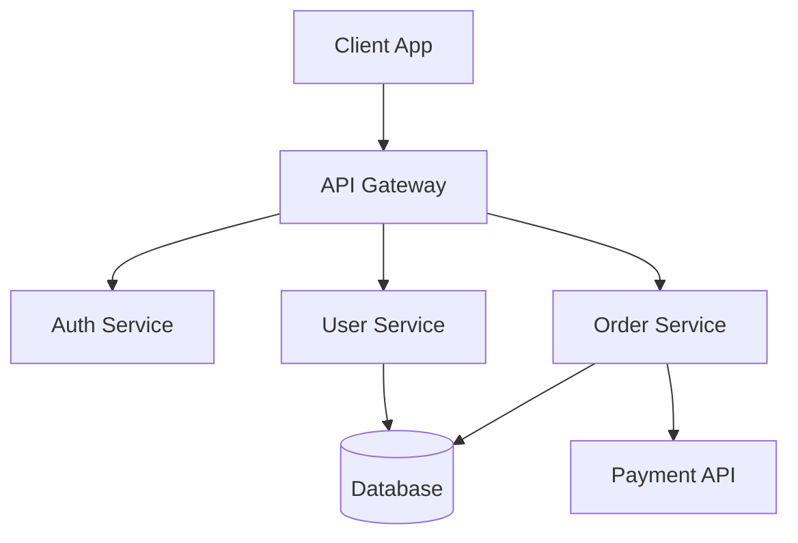
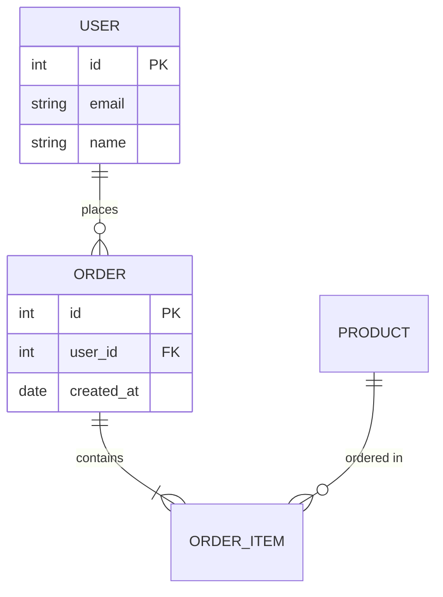

# Code Quality Assessment Report — Backend

**Project / Repo name:** _(codebase name)_  
**Tech stack:** _(e.g. Node 20, Go 1.21, Java 17 — language, framework, main version)_  
**Platform:** Backend (BE)  
**Assessment date:** YYYY-MM-DD  
**Report version:** 1.0  
**Assessed by:** AI Code Reviewer  
**Standards applied:** IEEE 730, IEEE 1016, IEEE 829, Clean Code, OWASP

---

## 1. Executive Summary

| Criterion         | Score | Rating                          |
| ----------------- | ----- | ------------------------------- |
| Code Organization | X/10  | Good / Fair / Needs improvement |
| Type Safety       | X/10  | Good / Fair / Needs improvement |
| Error Handling    | X/10  | Good / Fair / Needs improvement |
| Documentation     | X/10  | Good / Fair / Needs improvement |
| Testing           | X/10  | Good / Fair / Needs improvement |
| Maintainability   | X/10  | Good / Fair / Needs improvement |
| Security          | X/10  | Good / Fair / Needs improvement |

**Total score:** X/10 — **Overall rating:** Good

_Optional: Performance (response time, N+1, caching, connection pooling) — add row to table above if assessed._

---

## 1b. Risks / Critical Findings _(when applicable)_

- _(3–5 bullets: security risks, data loss, compliance, critical issues to address immediately)_

---

## 2. Codebase Statistics (Backend)

| Directory / concept       | File count / note | Description               |
| ------------------------- | ----------------- | ------------------------- |
| api/ controllers/ routes/ | XX                | HTTP handlers, routing    |
| services/ usecases/       | XX                | Business logic            |
| repositories/ dao/        | XX                | Data access               |
| models/ entities/ dto/    | XX                | Data structures           |
| config/ env/              | XX                | Configuration             |
| middleware/               | XX                | Auth, logging, rate limit |
| utils/ helpers/           | XX                | Shared utilities          |
| migrations/               | XX                | DB schema                 |
| tests/                    | XX                | Unit, integration         |

**Note:** Adjust folder names per language/framework (e.g. Node, Go, Java, .NET).

---

## 3. Dependencies, Libraries & Framework Review

### 3.1 Framework(s) and current version

| Item        | Current version | Notes (e.g. EOL, LTS) |
| ----------- | --------------- | ----------------------- |
| _(e.g. Node / Go / Java / .NET)_ | X.Y.Z | _(LTS until… / EOL…)_ |
| _(runtime / language)_            | X.Y.Z | |

### 3.2 Key libraries and versions

| Package / library   | Current | Latest  | Status              |
| ------------------- | ------- | ------ | ------------------- |
| _(name)_            | X.Y.Z   | X.Y.Z  | Up to date / Behind |
| _(name)_            | X.Y.Z   | X.Y.Z  |                     |

**Direct dependency count:** XX | **Outdated (total):** XX _(minor/patch: XX, major: XX)_

### 3.3 Upgrade suggestions

- **Safe to upgrade (patch/minor):** _(list or “None” / “See table above”)_
- **Suggest upgrade (minor/major, some risk):** _(list with suggested version)_
- **Major upgrade recommended:** _(e.g. framework or critical lib; note migration effort)_

### 3.4 Technical risks

- _(Deprecated APIs; packages nearing EOL; incompatibilities; lockfile or resolution issues.)_

### 3.5 Security and vulnerabilities

- **Audit summary:** _(e.g. npm audit / govulncheck / Snyk)_ — Critical: XX | High: XX | Medium: XX | Low: XX
- **Critical / High:** _(Package name, CVE or advisory, recommended fix e.g. “upgrade to X.Y.Z”)_
- **License risks:** _(if any)_

---

## 4. Strengths

### Code Organization

- _(Layers, modules, separation of concerns…)_

### Type Safety

- _(Typed API, DTOs, DB types…)_

### Error Handling

- _(Global handler, status codes, logging…)_

### Documentation

- _(README, API docs, runbooks…)_

### Testing

- _(Unit, integration, coverage %…)_

### Maintainability

- _(DI, single responsibility, file size…)_

### Security

- _(Auth, secrets, validation, rate limit…)_

### Performance _(when assessable)_

- _(Response time, N+1 queries, caching, connection pooling…)_

### CI/CD & Observability _(when applicable)_

- _(Build, test pipeline, deploy, logging/metrics/tracing…)_

---

## 5. Areas for Improvement

- _(List specific items with paths or module names)_

---

## 6. Recommendations

### 🔴 High Priority

- _(Clear actions, optionally tied to service/endpoint)_

### 🟡 Medium Priority

- _(Refactor, types, docs…)_

### 🟢 Low Priority

- _(Documentation, lint, tooling…)_

---

## 7. Conclusion

_(Summarize score, main strengths, improvement priorities, and short-term goals.)_

---

## 8. Action Items (Optional)

### Immediate (1–2 weeks)

- [ ]
- [ ]

### Short-term (1 month)

- [ ]
- [ ]

### Long-term (3 months)

- [ ]
- [ ]

---

## 9. Architecture & Database Diagrams

### 9.1 Architecture Diagram

_(Automatically generated Mermaid diagram showing service layers, API structure, and key modules)_

_Description: This diagram shows the high-level architecture with API gateway routing to services, and data flow to the database._

### 9.2 Database Diagram

_(Automatically generated Mermaid ER diagram showing main entities and relationships)_

_Description: This diagram shows the main database entities and their relationships identified from the codebase._

---
