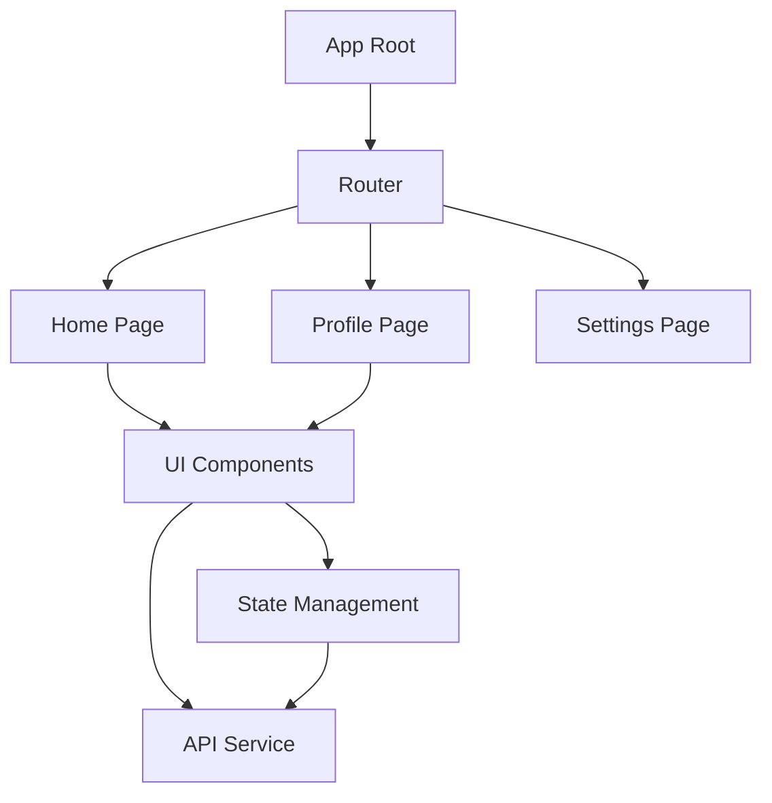
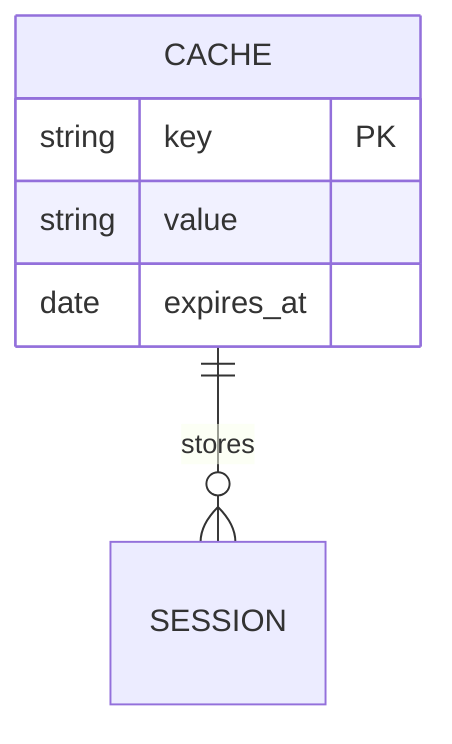

# Code Quality Assessment Report — Frontend

**Project / Repo name:** _(codebase name)_  
**Tech stack:** _(e.g. Flutter 3.x, React 18, Next 14 — language, framework, main version)_  
**Platform:** Frontend — **Scope:** Mobile / Web / Mobile & Web _(choose one)_  
**Assessment date:** YYYY-MM-DD  
**Report version:** 1.0  
**Assessed by:** AI Code Reviewer  
**Standards applied:** IEEE 730, IEEE 1016, IEEE 829, Clean Code, OWASP

---

## 1. Executive Summary

| Criterion         | Score | Rating                          |
| ----------------- | ----- | ------------------------------- |
| Code Organization | X/10  | Good / Fair / Needs improvement |
| Type Safety       | X/10  | Good / Fair / Needs improvement |
| Error Handling    | X/10  | Good / Fair / Needs improvement |
| Documentation     | X/10  | Good / Fair / Needs improvement |
| Testing           | X/10  | Good / Fair / Needs improvement |
| Maintainability   | X/10  | Good / Fair / Needs improvement |
| Security          | X/10  | Good / Fair / Needs improvement |

**Total score:** X/10 — **Overall rating:** Good

_Optional: Performance (bundle size, Core Web Vitals, lazy load) — add row to table above if assessed._

---

## 1b. Risks / Critical Findings _(when applicable)_

- _(3–5 bullets: security risks, data loss, compliance issues, critical bugs to address immediately)_

---

## 2. Codebase Statistics (Frontend)

_If Mobile only: use Mobile structure. If Web only: use Web structure. If both: use two tables (Mobile / Web)._

### Mobile (Flutter / React Native / …)

| Directory            | File count | Description                   |
| -------------------- | ---------- | ----------------------------- |
| features/            | XX         | Feature modules (state + UI)  |
| widgets/ components/ | XX         | Reusable UI components        |
| package/ lib/        | XX         | Internal packages / modules   |
| utils/               | XX         | Helpers, services             |
| config/              | XX         | Routes, env, theme            |
| localization/        | XX         | i18n                          |
| common/              | XX         | Shared logic, base components |

### Web (React / Vue / Next / …)

| Directory       | File count | Description            |
| --------------- | ---------- | ---------------------- |
| components/     | XX         | Reusable UI components |
| pages/ views/   | XX         | Pages / views          |
| hooks/ store/   | XX         | State, hooks, store    |
| services/ api/  | XX         | API client, services   |
| config/         | XX         | Config, env, routes    |
| utils/ helpers/ | XX         | Utilities              |
| styles/ assets/ | XX         | Styles, assets         |

**Total files:** XXX | **Test files:** XX | **Test coverage:** XX% _(if available)_

---

## 3. Dependencies, Libraries & Framework Review

### 3.1 Framework(s) and current version

| Item        | Current version | Notes (e.g. EOL, LTS) |
| ----------- | --------------- | ----------------------- |
| _(e.g. Flutter / React / Next)_ | X.Y.Z | _(LTS until… / EOL…)_ |
| _(e.g. Dart / Node)_            | X.Y.Z | |

### 3.2 Key libraries and versions

| Package / library   | Current | Latest  | Status              |
| ------------------- | ------- | ------ | ------------------- |
| _(name)_            | X.Y.Z   | X.Y.Z  | Up to date / Behind |
| _(name)_            | X.Y.Z   | X.Y.Z  |                     |

**Direct dependency count:** XX | **Outdated (total):** XX _(minor/patch: XX, major: XX)_

### 3.3 Upgrade suggestions

- **Safe to upgrade (patch/minor):** _(list or “None” / “See table above”)_
- **Suggest upgrade (minor/major, some risk):** _(list with suggested version)_
- **Major upgrade recommended:** _(e.g. framework or critical lib; note migration effort)_

### 3.4 Technical risks

- _(Deprecated APIs; packages nearing EOL; peer/version conflicts; lockfile or resolution issues.)_

### 3.5 Security and vulnerabilities

- **Audit summary:** _(e.g. npm audit / dart pub / Snyk)_ — Critical: XX | High: XX | Medium: XX | Low: XX
- **Critical / High:** _(Package name, CVE or advisory, recommended fix e.g. “upgrade to X.Y.Z”)_
- **License risks:** _(if any)_

---

## 4. Strengths

### Code Organization

- _(Feature/page structure, state vs UI separation, naming…)_

### Type Safety

- _(Null safety / TypeScript, types, lint…)_

### Error Handling

- _(Error boundary, user messages, logging / Sentry…)_

### Documentation

- _(README, doc comments, setup…)_

### Testing

- _(Unit, component/widget, e2e, coverage…)_

### Maintainability

- _(DI/state, component size, reuse…)_

### Security

- _(Env, token storage, CSP, input validation…)_

### Accessibility (a11y) _(when assessable)_

- _(WCAG, screen reader, contrast, focus, semantic HTML…)_

### Performance _(when assessable)_

- _(Bundle size, Core Web Vitals, lazy load, image optimization…)_

### CI/CD & Observability _(when applicable)_

- _(Build, test pipeline, deploy, logging/metrics…)_

---

## 5. Areas for Improvement

- _(List specific items with file paths when relevant)_

---

## 6. Recommendations

### 🔴 High Priority

- _(Clear actions, optionally tied to file/package)_

### 🟡 Medium Priority

- _(Refactor, type safety, docs…)_

### 🟢 Low Priority

- _(Documentation, lint rules…)_

---

## 7. Conclusion

_(Summarize score, main strengths, improvement priorities, and short-term goals.)_

---

## 8. Action Items (Optional)

### Immediate (1–2 weeks)

- [ ]
- [ ]

### Short-term (1 month)

- [ ]
- [ ]

### Long-term (3 months)

- [ ]
- [ ]

---

## 9. Architecture & Database Diagrams

### 9.1 Architecture Diagram

_(Automatically generated Mermaid diagram showing component/feature structure, state management flow, and key modules)_

_Description: This diagram shows the high-level frontend architecture with routing, component hierarchy, and state management flow._

### 9.2 Database Diagram _(if applicable)_

_(Only include if frontend directly interacts with a database. Otherwise, omit this subsection.)_

_Description: This diagram shows database entities if the frontend uses local database or cache._

---
